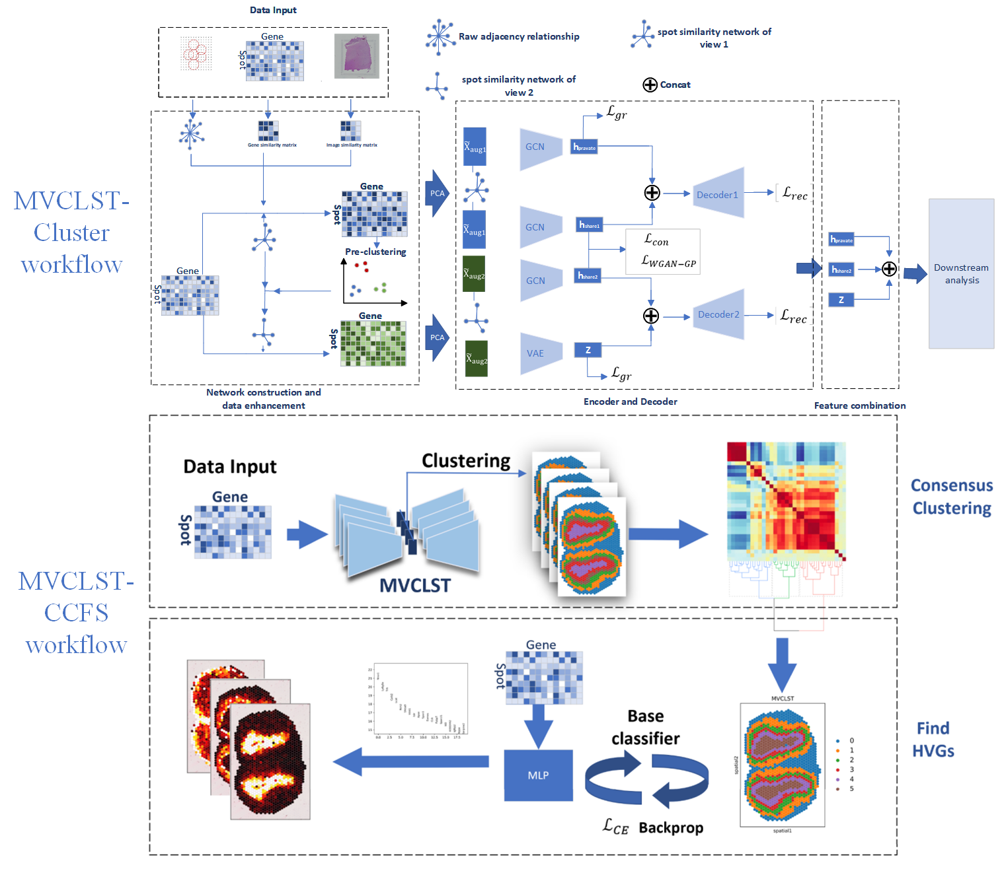
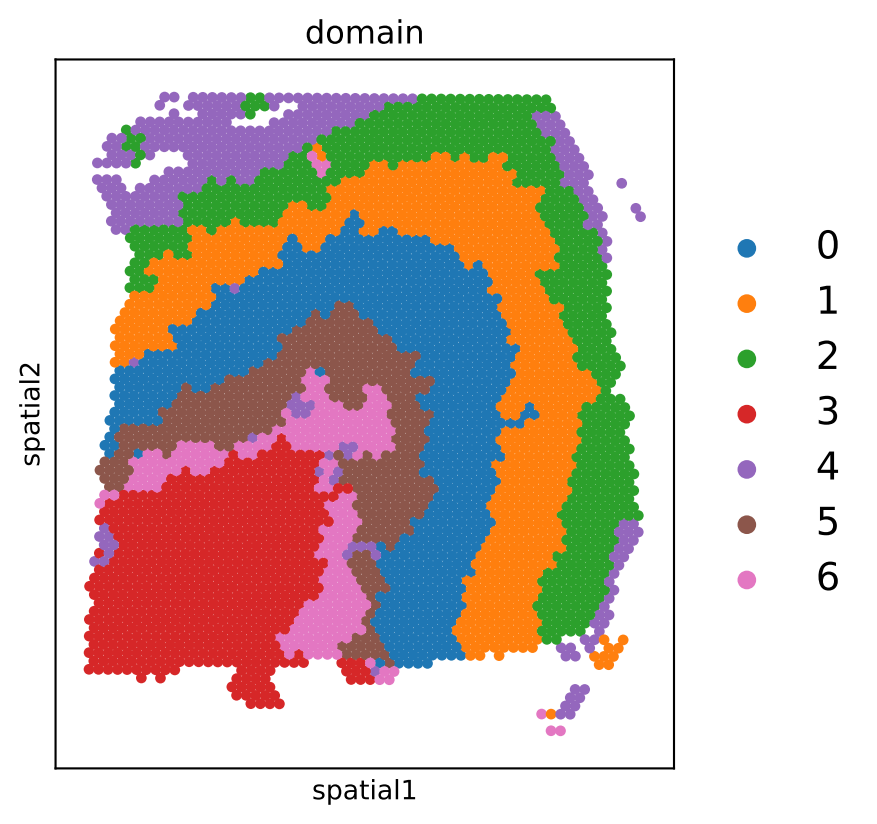

README
===============================
MVCLST: a spatial transcriptome data analysis pipeline for cell type classification based on multi-view comparative learning
This document mainly introduces the python code of MVCLST-CCFS algorithm.

# Requirements
- pytorch==1.12.1
- numpy==1.21.0
- scipy==1.10.1 
- scikit-learn=0.24.1
- torch-geometric==2.3.0
- torch-sparse ==0.6.16
- scanpy==1.7.2
- python==3.8.16
- h5py==2.10.0 
- anndata==0.7.6

# Instructions
This project includes all the code for the MVCLST algorithm experimentally performed on a dataset (DLPFC), mouse brain tissue sections, and mouse olfactory bulb data. We only introduce the algorithm MVCLST proposed in our paper, and the introduction of other algorithms can be found in the corresponding papers.

# Model composition and meaning
MVCLST is composed of common modules and experimental modules.

## Common module
- Data defines the data used by the model
	- DLPFC
		- 151673
			- filtered_feature_bc_matrix.h5
			- metadata.tsv
			- spatial
				- histology.tif
				- scalefactors_json.json
				- tissue_hires_image.png
				- tissue_lowres_image.png
				- tissue_positions_list.csv
- CCFS.py defines all the functions required for MVCLST-CCFS.
- augment.py defines the augmentation of the model.			
- get_data.py defines the data loading of the model.
- MVCLST.py defines the complete MVCLST model.
- utils.py and untils_copy.py defines the tool functions needed by the entire algorithm during its operation.
- img_feature.py defines the method to extract image feature of the model.

## Experimental module
The main.py file can perform all data experiments on the same dataset. If you only want to run to obtain clustering results, you can call the MVCLST-CLUSTER function in main and set CC_num to 1. If you need to perform consensus clustering analysis and search for differentially expressed genes, you can call the function in CCFS.py. In the subsequent statistical analysis, we will check the output of the main file. The utils.py file contains all the tools required for the performance and analysis of the entire experiment, including ARI, NMI scores and data conversion calculations, consensus clustering calculations, and gene score calculations. If you need to run the data in the project, you need to go to the corresponding website to download the tissue slice chart ending with .tif.All features were developed using PyTorch and support CUDA.
### Installation
#### Start by grabbing this source codes:
```bash
git clone https://codeload.github.com/weiba/MVCLST.git
cd MVCLST
```
## step1 Installing PyTorch’s CUDA support or CPU support on Linux
pip3 install torch==1.13.0+cu116 torchvision torchaudio --extra-index-url https://download.pytorch.org/whl/cu116  #### GPU
pip3 install torch==1.13.0 torchvision torchaudio --extra-index-url https://download.pytorch.org/whl/cpu  #### CPU
## step2 Installing PyG package. If unsuccessful, refer to the "Install PyG package".
pip install pyg_lib torch_scatter torch_sparse torch_cluster torch_spline_conv torch_geometric -f https://data.pyg.org/whl/torch-1.13.0+cu116.html #### GPU
pip install pyg_lib torch_scatter torch_sparse torch_cluster torch_spline_conv torch_geometric -f https://data.pyg.org/whl/torch-1.13.0+cpu.html  ### CPU
## step3 Download other dependencies
### Installing additional packages(optional)

<details>
  <summary> 1. Install PyTorch package </summary>
  
  + #### Installation via [Anaconda](https://anaconda.org/pyg/pyg).
```bash
conda install pytorch torchvision torchaudio cudatoolkit=10.2 -c pytorch
```
  + #### Installation via [Pip Wheels](https://pytorch-geometric.readthedocs.io/en/latest/notes/installation.html#installation-via-pip-wheels)
```bash
pip3 install torch torchvision torchaudio
```
</details>

<details>
  <summary> 2. Install PyG package </summary>
           
  + Installation via [Anaconda](https://anaconda.org/pyg/pyg).

You can now install PyG via Anaconda for all major OS/PyTorch/CUDA combinations 🤗 Given that you have [PyTorch >= 1.8.0](https://pytorch.org/get-started/locally/) installed, simply run:
```bash
conda install pyg -c pyg -c conda-forge
```
  + Installation via [Pip Wheels](https://pytorch-geometric.readthedocs.io/en/latest/notes/installation.html#installation-via-pip-wheels)

We have outsourced a lot of functionality of PyG to other packages, which needs to be installed in advance. These packages come with their own CPU and GPU kernel implementations based on the PyTorch C++/CUDA extension interface. We provide pip wheels for these packages for all major OS/PyTorch/CUDA combinations:
```bash
pip install pyg -c pyg -c conda-forge
</details>
```python
######Firstly, we load the packages required for running the modified code
import os 
import matplotlib.pyplot as plt
from pathlib import Path
import pandas as pd
from get_data import run
import scanpy as sc
from sklearn import metrics
from scipy.spatial import distance
from utils import *
from torch_geometric.nn import HypergraphConv
from MVCLST import train
import anndata
from scipy.stats import zscore
from utils_copy import clustering
from sklearn.metrics import silhouette_score
from augment import *
from scipy.spatial.distance import pdist, squareform
```
Next, we will set the data we are about to process. Here, we set the data as 151673 from the DLPFC dataset, as well as the output folder address after running the data, and some values that need to be pre-set in advance, such as the number of clusters in the cluster.Parameter: pca_nc=n represents PCA dimensionality reduction to n-dimensional, 
```python
sample_list = ['151673']
for sample in sample_list:
    data_path = "./data/151673" 
    data_name = sample
    save_path = data_path+"/"+sample+"save" #### save path
    save_path_figure = Path(os.path.join(save_path, "Figure", data_name))
    save_path_figure.mkdir(parents=True, exist_ok=True)
    if data_name in ['151669','151670','151671','151672']:
        n_domains = 5
    else:
        n_domains = 6
    data = run(save_path = save_path, 
        platform = "Visium",
        pca_n_comps = 128,
        pre_epochs = 800,
        vit_type='vit_b',#'vit'
        )
    if sample=="151671":
        i=6	
    else:
        i=0
```
We will read our data labels and data here, where we use _get-data to read the data we need and process it into the appropriate format and Enhance data , please refer to augment.py for specific details.The data we read here includes histology.tif ,filtered_feature_bc_matrix.h5 and metadata.tsv.

```python
df_meta = pd.read_csv(data_path+'/'+data_name+'/metadata.tsv', sep='\t')
adata =data._get_adata(data_path, data_name)
adata = data._get_augment(adata, adjacent_weight = 1, neighbour_k =6)
```
The preparation and screening of data are referred to as our data preprocessing here.After this processing, the data will be filtered out of non ideal data and the data values will be normalized. We will perform dimensionality reduction on the data, which will be used in the subsequent pre clustering.Two rounds of PCA were used to reduce dimensions to 128 and 1000, with 128 dimensions used for the subsequent pre clustering and 1000 dimensions used as the representation data for the first view.
```python
adata1=adata.copy()
adata.X = adata.obsm["augment_gene_data"].astype(float)
sc.pp.filter_genes(adata, min_cells=3)
sc.pp.highly_variable_genes(adata, flavor="seurat_v3", n_top_genes=3000)
adata_X = sc.pp.normalize_total(adata, target_sum=1, exclude_highly_expressed=True, inplace=False)['X']
adata_X = sc.pp.log1p(adata_X)
adata_X = sc.pp.scale(adata_X)
inputs1 = sc.pp.pca(adata_X, n_comps=128)
inputs = sc.pp.pca(adata_X, n_comps=1000)
```
Pre clustering, where we process the pre clustered data, including transforming it into a graph structure and masking the neighbor relationships in the pre clustering results.The operation here includes determining the neighbor relationships of the second view generated by masking the neighbor relationships through pre clustering, and enhancing the original data through the neighbor relationships of the second view to generate the expression data of the second view.Preprocess the data from the second view, reduce the dimensionality of the preprocessed data, and convert it with the data from the previous first view to prepare the data for the model.Here, 6 represents finding the nearest 6 spots as neighboring nodes.
```python
cluster_label,_=cluster(adata,inputs1,df_meta,n_domains)
cluster_adj=create_adjacency_matrix(cluster_label)
adj_augment = adata.obsm["weights_matrix_all"]
adj_augment=sim2adj(adj_augment,6)
adj_pure=sim2adj(adata.obsm["weights_matrix_nomd"],6)
adj_pure=cluster_adj*adj_pure
adata1.obsm['weights_matrix_all']=adj_pure
adata1=find_adjacent_spot(
adata1,
use_data = "raw",
neighbour_k = 6,
weights='weights_matrix_all',
verbose = False,
)
adata1=augment_gene_data(
adata1,
use_data = "raw",
adjacent_weight = 1,
)
adata1.X = adata1.obsm["augment_gene_data"].astype(float)
adata1_X = sc.pp.normalize_total(adata1, target_sum=1, exclude_highly_expressed=True, inplace=False)['X']
adata1_X = sc.pp.log1p(adata1_X)
adata1_X = sc.pp.scale(adata1_X)
inputs2 = sc.pp.pca(adata1_X, n_comps=1000)
X=inputs.copy()
X2=inputs2.copy()
X=torch.tensor(X,dtype=torch.float)
X2=torch.tensor(X2,dtype=torch.float)
adj_pure = adata.obsm["weights_matrix_nomd"]
adj_pure = cluster_adj*adj_pure
adj_pure =sim2adj(adj_pure ,6)
adj_augment=torch.tensor(adj_augment,dtype=torch.float)
adj_pure=torch.tensor(adj_pure,dtype=torch.float)
print("done")
```
Feed the prepared data into the model for training, including adata data, enhanced gene expression data and neighbor structure from the first view, and enhanced gene expression data and neighbor structure from the second view. Label data is only sent here to monitor the feature extraction during the data learning process. And cluster number data. In this step, we will obtain the data features extracted by the trained model.
```python
best_features=train(adata,X,X2,adj_pure,adj_augment,df_meta,n_domains)
```
We use the features extracted by the trained model for the next clustering operation and generate spatial domain partition images. Cluster our extracted features and print the ARI of the clustering results. Save our processed spatial transcriptome data as. h5ad data.
```python
_,ARI=cluster(adata,best_features,df_meta,n_domains,refined=True)
data.plot_domains(adata, data_name)
print(adata)
adata.write(os.path.join(save_path, f'{data_name}.h5ad'),compression="gzip")
```

# Contact
If you have any question regard our code or data, please do not hesitate to open a issue or directly contact me (weipeng1980@gmail.com).
